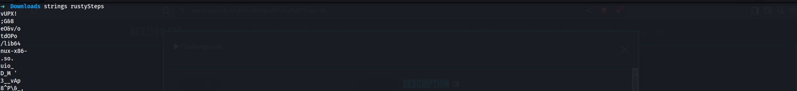
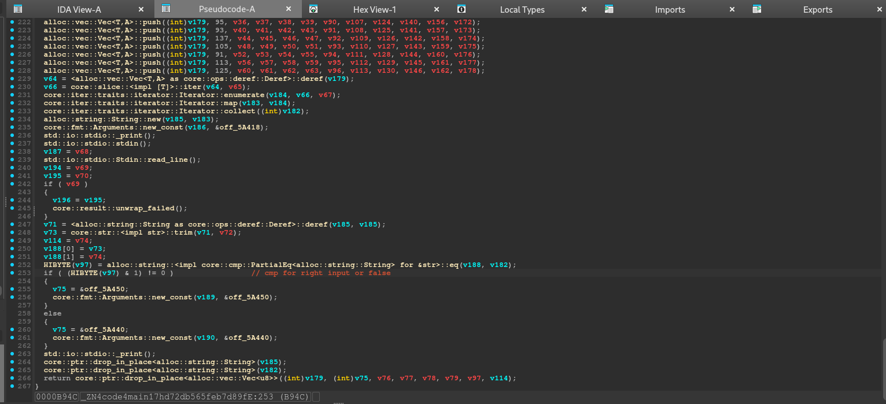
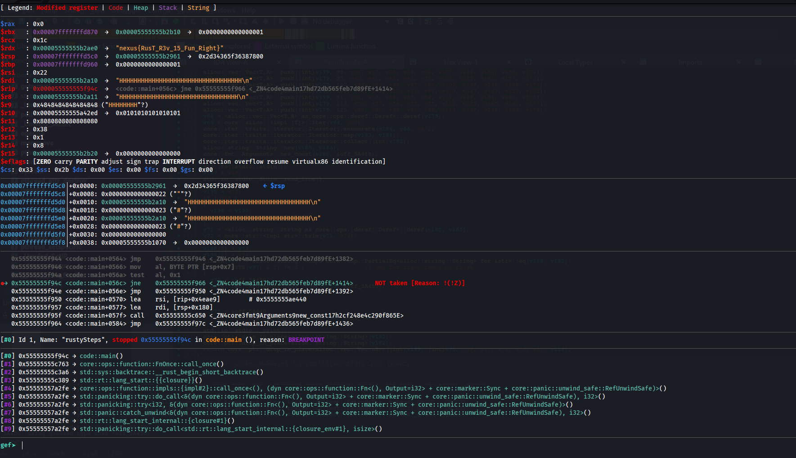
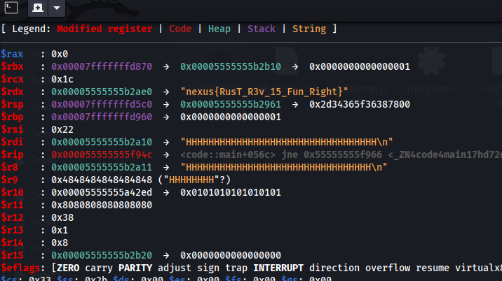

## Rusty Steps Writeup

### Overview
This writeup details the steps to reverse engineer and analyze the binary `rustySteps`. The challenge has 7 solves and is tagged as "easy". The flag is `nexus{RusT_R3v_15_Fun_Right}`.

---

### Step 1: Identifying UPX Packing
After running the `strings` command on the binary, we observe indications of UPX packing:



To unpack the binary, we use the following command:
```bash
upx -d rustySteps
```

---

### Step 2: Analyzing with `strings` Again
After unpacking, running `strings` again reveals more interesting strings. This gives us clues for further analysis.

---

### Step 3: Opening in IDA
We load the binary into IDA for decompilation and analysis:



We identify a specific offset of interest and decide to set a breakpoint to observe its behavior.

---

### Step 4: Debugging with GDB
Using GDB, we set a breakpoint at the identified offset:
```bash
b *($base + 0xb94c)
```

We then provide dummy input to the program. When the breakpoint is hit, we analyze the program's behavior.

---

### Step 5: Extracting the Flag
After stepping through the program, we successfully retrieve the flag:



The flag is:


---

### Conclusion
This challenge demonstrates the process of unpacking, analyzing, and debugging a binary to extract the flag. The final flag is:
```
nexus{RusT_R3v_15_Fun_Right}
```
